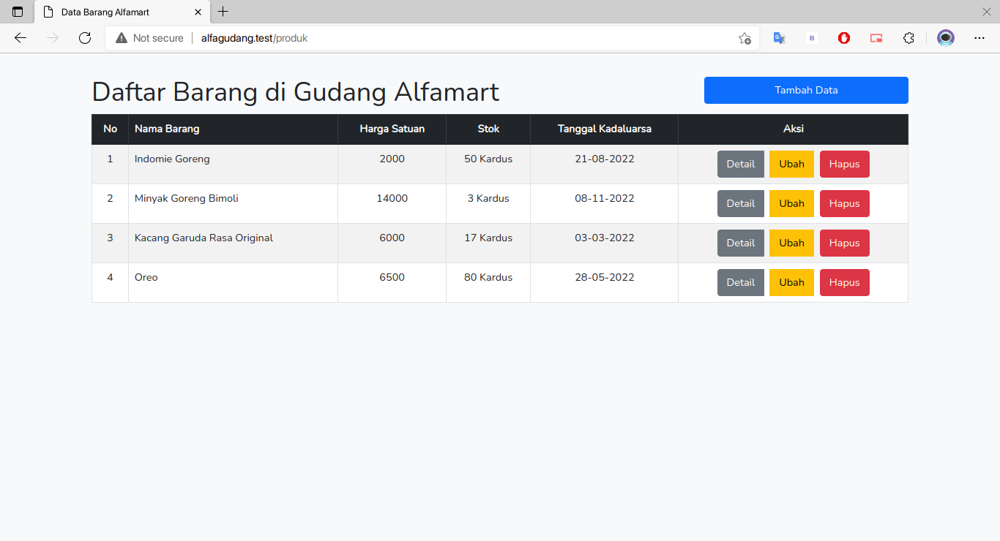

# AlfaGudang

Project ini dibuat untuk memenuhi UTS matakuliah pemrograman web. Didalamnya terdapat CRUD (Create Read Update Delete) untuk mengelola data yang diperlukan.

Persyaratan UTS yang sudah terpenuhi dalam project ini:

-   [x] Laravel UI
-   [x] Form
-   [x] Form Validation
-   [x] Routing Resource

## Laravel

Dalam pembuatan project ini kami menggunakan framework php yang bernama Laravel untuk memudahkan dalam pengerjaan

